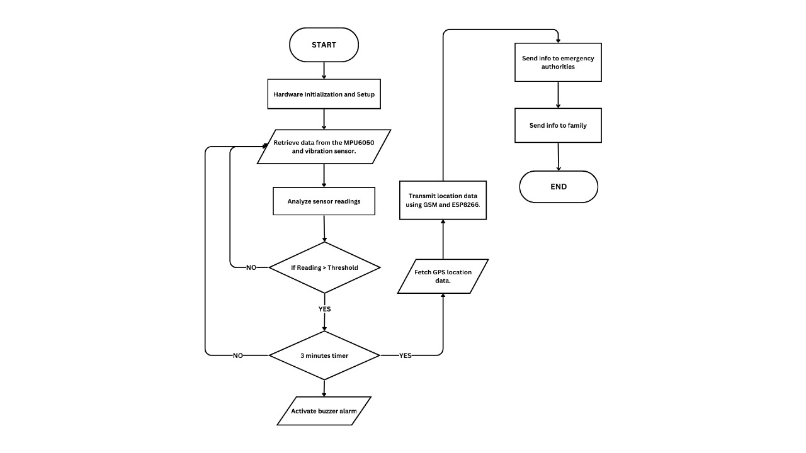

# Accident Detection System For Scooters

## Introduction
Welcome to the Accident Detection System for scooters. This project is designed to enhance safety for scooter riders by detecting accidents in real-time and alerting emergency services and predefined contacts immediately. The system uses sensors and connectivity modules integrated into the scooter to monitor for potential accident scenarios.

***Note: This project is currently a work in progress. Features and documentation may be updated frequently as we continue to develop the system.***

## Features
- **Accident Detection:** Leverages the MPU and vibration sensors to detect impacts and sudden changes in motion, indicative of an accident.
- **Emergency Alerts:** Automatically notifies emergency services using the GPS location data when an accident is detected.
- **Mobile App Integration:** Includes a basic application that communicates with the Arduino to show real-time data and allows users to set up their emergency contacts and preferences.
- **GPS Tracking:** Uses GPS to provide accurate location tracking, essential for emergency response.

## Components
- Arduino Uno R3
- MPU (Motion Processing Unit)
- Vibration Sensor
- GPS Module
- Emergency Stop Operator (ESO)
- Basic mobile app (compatible with Android)

## Flowchart

  
