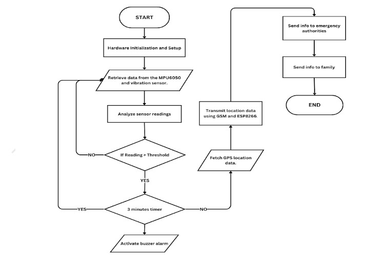
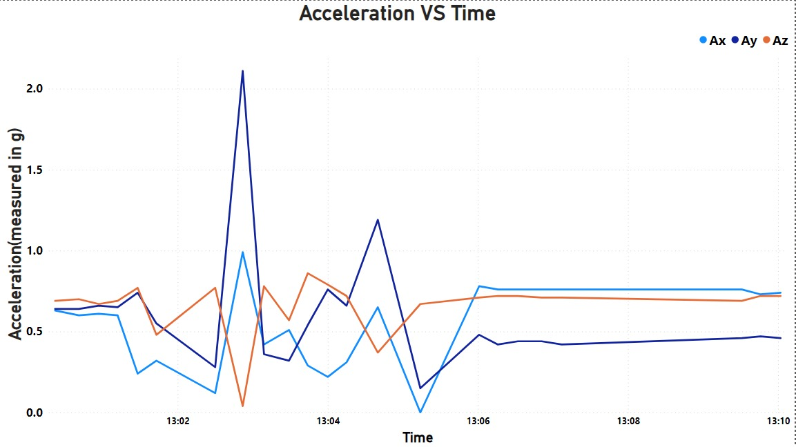
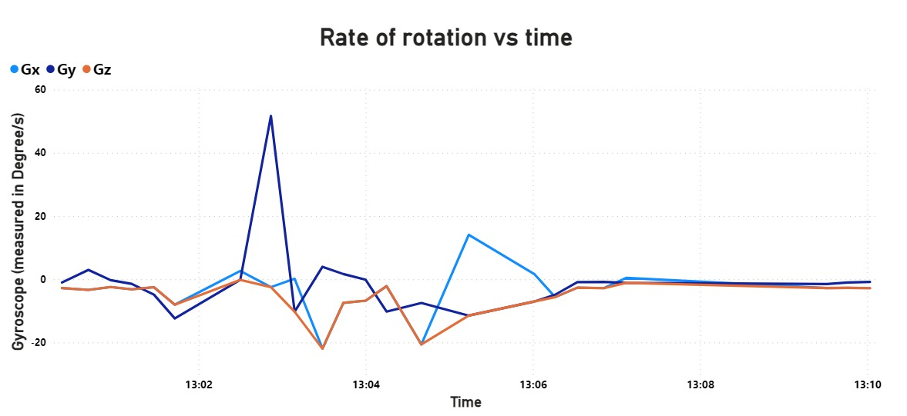
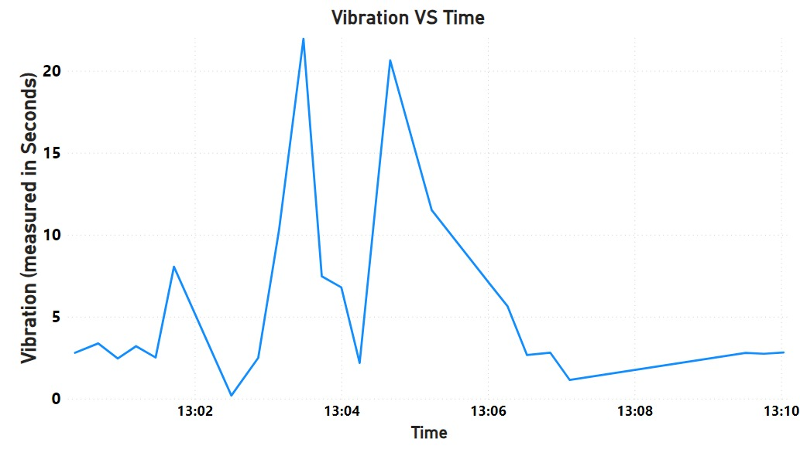

# Accident Detection System For Scooters

## Introduction
Welcome to the Accident Detection System for scooters. This project is designed to enhance safety for scooter riders by detecting accidents in real-time and alerting emergency services and predefined contacts immediately. The system uses sensors and connectivity modules integrated into the scooter to monitor for potential accident scenarios.

***Note: This project is currently a work in progress. Features and documentation may be updated frequently as we continue to develop the system.***

## Features
- **Accident Detection:** Leverages the MPU and vibration sensors to detect impacts and sudden changes in motion, indicative of an accident.
- **Emergency Alerts:** Automatically notifies emergency services using the GPS location data when an accident is detected.
- **Mobile App Integration:** Includes a basic application that communicates with the Arduino to show real-time data and allows users to set up their emergency contacts and preferences.
- **GPS Tracking:** Uses GPS to provide accurate location tracking, essential for emergency response.

## Components
- Arduino Uno R3
- MPU (Motion Processing Unit)
- Vibration Sensor
- GPS Module
- Basic mobile app (compatible with Android)

## Flowchart

# Data 
## Acquisition: 
The module was attached over the speedometer of the scooter to data acquisitions.The data acquired was from MPU6050 sensor and  SW420 -vibration sensor.From MPU6050 the accelerometer and gyroscope readings are being acquired.From the accelerometer readings the acceleration of the vehicle in terms of the 3 different axis is being acquired it terms of “g”(acceleration due to gravity ) from the gyroscope the rate of rotation in terms of the 3 different axis is being acquired in terms of degree/s .The vibration sensor readings are in terms of milliseconds (how long did the vibrations last). 
The readings are being read from the sensors and are being sent to the Arduino Uno R3 and these readings are sent to ESP8266 viva UART communication protocol.The readings received by the ESP8266 module which has wifi connectivity is sending the data to ThingSpeak cloud which collects the the website.From there the stored data is being downloaded as a CSV file and the data is being visualized using Microsoft Power BI.

## Plots
+ **Accelerometer data from MPU6050**

+ **Gyroscope data from MPU6050**

+ **Vibartion Sensor Data**

  
